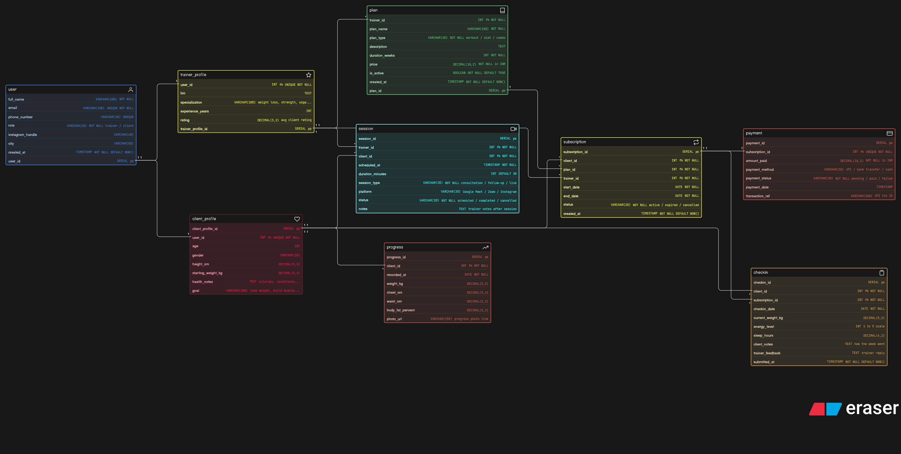

# Fitness Influencer Coaching Platform - ER Diagram

## About
ER diagram designed for an online fitness coaching platform where trainers manage clients, sell coaching plans, schedule sessions and track progress.

## Diagram

## Tables
- user
- trainer_profile
- client_profile
- plan
- subscription
- session
- checkin
- progress
- payment

## Key Design Decisions
- Single `user` table with `role` field for both trainers and clients
- Separate `trainer_profile` and `client_profile` for role-specific data
- `checkin` and `progress` are separate - checkin is weekly subjective report, progress is objective body measurements
- `session` is independent of subscription - consultation can happen without a plan
- `transaction_ref` in payment for UPI verification