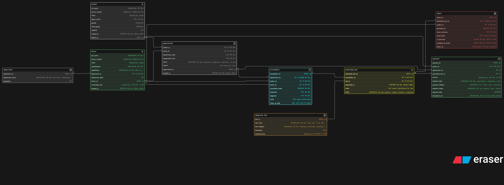

# Clinic Appointment and Diagnostics Platform - ER Diagram

## About
ER diagram designed for a modern clinic managing doctors, patients, appointments, consultations, diagnostic tests, reports and payments.

## Diagram

## Tables
- patient
- department
- doctor
- appointment
- consultation
- diagnostic_test
- prescribed_test
- report
- payment

## Key Design Decisions
- `appointment` and `consultation` are separate - no-show means appointment exists but consultation does not
- `prescribed_test` as junction table - one consultation can lead to many tests
- `diagnostic_test` is a master catalog - reusable across all consultations
- `department` as separate entity - multiple doctors per department
- `is_abnormal` flag in report - quick filter for critical results
- Payment linked to both `appointment` and `prescribed_test` - consultation fee and test fee are separate