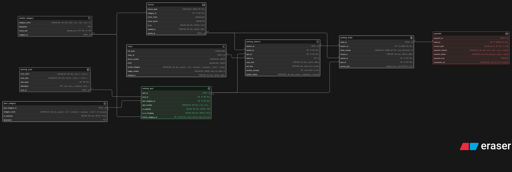

# Comic-Con Parking System - ER Diagram

## About
ER diagram designed for a multi-zone event parking system managing vehicles, spot allocation, parking sessions, tickets and payments across Comic-Con India venue.

## Diagram

## Tables
- vehicle_category
- vehicle
- parking_zone
- spot_category
- parking_spot
- visitor
- parking_session
- parking_ticket
- payment

## Key Design Decisions
- `parking_session` and `parking_ticket` are separate - session tracks time, ticket is the issued document
- `exit_time NULL` means vehicle is currently parked - easy real-time tracking
- `spot_category` handles VIP, exhibitor, cosplayer, staff and EV charging as reserved categories
- `is_available` boolean on parking spot for real-time availability tracking
- `vehicle_category_id` on parking spot ensures bike spots cannot be assigned to cars
- Same spot reused across sessions - spot is independent, each visit creates a new session row