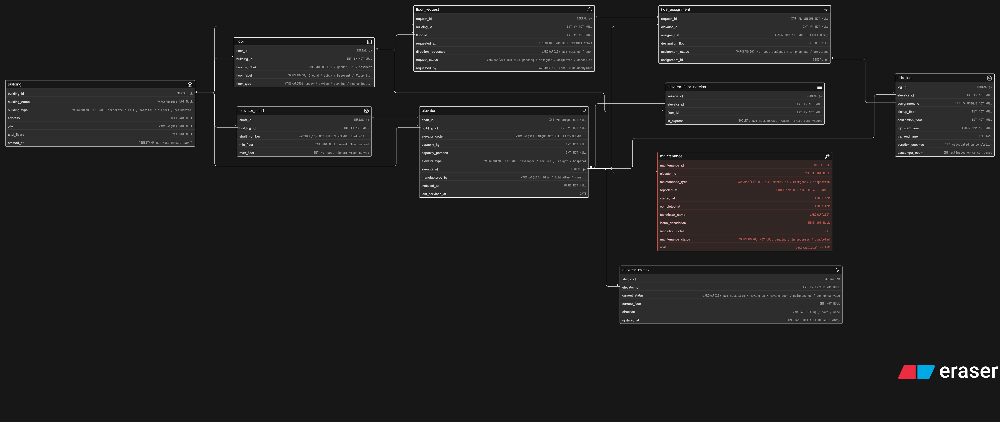

# Smart Elevator Control System - ER Diagram

## About
ER diagram designed for LiftGrid Systems - a multi-building intelligent elevator control platform managing elevators, floor requests, ride assignments, status tracking and maintenance across corporate towers, malls, airports and hospitals.

## Diagram

## Tables
- building
- floor
- elevator_shaft
- elevator
- elevator_status
- elevator_floor_service
- floor_request
- ride_assignment
- ride_log
- maintenance

## Key Design Decisions
- `elevator_shaft` and `elevator` are separate - shaft is physical infrastructure, elevator is the machine inside it
- `elevator_status` separate from `elevator` - static config vs dynamic real-time state never mixed
- `elevator_floor_service` junction table - M:N between elevators and floors with `is_express` flag
- `floor_request` and `ride_assignment` are separate - request is what user pressed, assignment is what system decided
- `ride_log` separate from `ride_assignment` - assignment is the plan, log is what actually happened
- Maintenance always adds new row - full history preserved, nothing overwritten